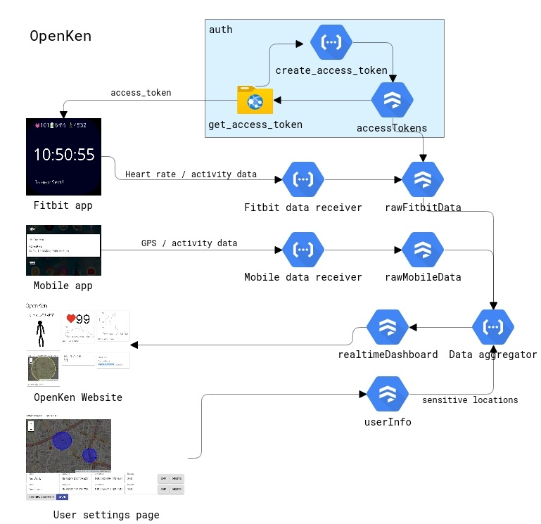

# Overview

OpenKen is a project to allow the world (and family) to spy on Ken's sensor data at https://open-ken.web.app. This is primarily to collectively watch over his health but also to just see what happens when the world can watch you.

# Architecture



[Edit diagram](https://app.cloudskew.com/editor/b2b35deb-9464-4875-9bf0-3ee97e2d3dc6)

- Fitbit (App on fitbit streams sensor data (heartrate, sleep) to data receiver)
- Android app (App on Ken's phone streams sensor data (location, phone use) to data receiver)
- Data Receiver (Firestore DB to collect raw sensor data)
- Data Presenter (Cloud functions aggregate sensor data to create presentation data for the Peeker.)
- Ken Peeker (Web frontend on Firebase Hosting)

## Fitbit app

The app runs on the fitbit device continuously (which means you need to keep it as the "front" app the whole time), and sends latest data (heart rate, battery level, etc) to the data receiver periodically (currently, every 30 seconds). This is stored in a raw data collection (rawFitbitData).

In order to identify the user, we made a simple custom authentication solution:

- In the fitbit app settings page, the user clicks on a link (https://open-ken.web.app/access_token) where they authenticate themselves with firebase auth, and generates a unique access token.
- They then store the access token in the settings. The fitbit app sends this access token along with sensing data to the data receiver.
- The data receiver dereferences the access token to get the user ID, and stores the data along with the user ID.

(While custom auth solutions are almost always a bad idea, this was the only way I could provide some level of security in the Fibit side (whose restrictions disallow any linking of Firebase libraries) while making the rest of the system work with Firebase auth.)

## Data aggregator

Several Cloud Functions, triggering on new writes of raw data (e.g rawFitbitData), aggregates the last 30 minutes of data for a user and writes it in the Firestore collection realtimeDashboard. This is the data backing the realtime dashboard.

Aggregated data includes:

- Realtime heart rate
- Activity state (asleep, walking, running, etc).
- Past 10 minutes of location
- Activity level plots for the past 10 minutes.

To retain some control over privacy, the aggregator performs some crude fuzzing of location data; users can register "sensitive" locations in the userInfo table, which, if a location data falls inside of, gets smeared out in the aggregated data.

## Ken Peeker (web dashboard)

Just a react app that monitors the Firestore realtimeDashboard collection for a specified user (by default, Ken) and renders data on the screen.

# Setup

```
git clone https://github.com/kenkawakenkenke/openken.git
```
